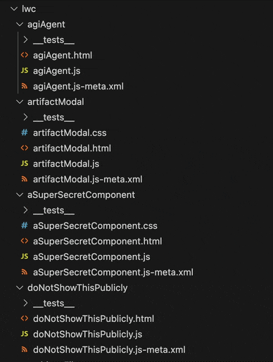

# LWC CSS Helper

A Visual Studio Code extension that makes it easy to add CSS files to your Lightning Web Components (LWC) in Salesforce development projects.

## The Problem

When developing Lightning Web Components using the Salesforce Extensions for VS Code, the `SFDX: Create Lightning Web Component` command doesn't generate a CSS file by default. Adding a CSS file manually requires several steps.

## The Solution

This extension adds a simple right-click context menu option called "NAKODX: Add CSS File" when you right-click on an LWC folder in your project. With one click, it:
1. Creates a properly named CSS file in your LWC folder
2. Opens the file in the editor
3. Pre-fills it with a basic comment template

**Enjoy!**